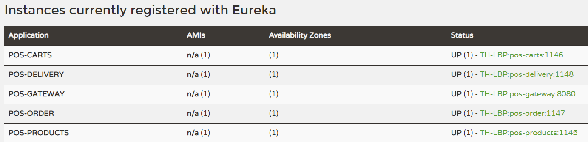
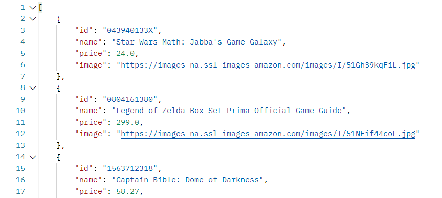
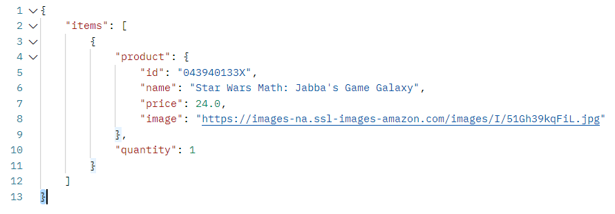
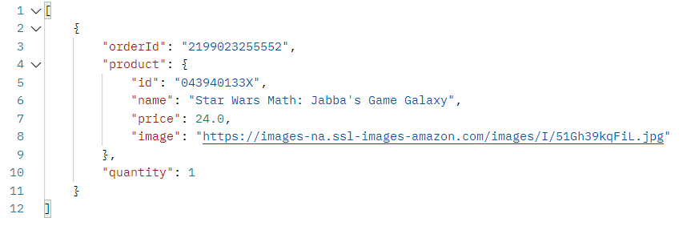
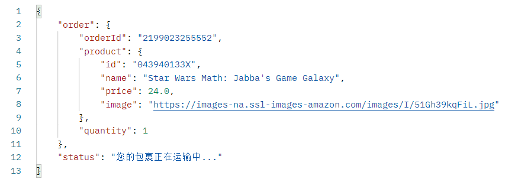

# aw07

### 一、模块的新增和修改

在aw05的整体框架下，所用的技术没有发生改变，缓存依旧使用的是ehcache，新增的和原本的api设计风格也还是restful风格，整体的架构是依赖于spring cloud，只不过部分数据来源从网络变成了mysql数据库。

##### 1、pos-carts模块新增功能

- 在原有模块之上，对于支付购物车中的物品的处理逻辑，进行了改变，也就是通过远程调用新增模块pos-order中的某个api，从而实现创建订单的功能。

##### 2、新增模块pos-order

该模块用于处理用户的订单请求

- 再一次http请求所携带的参数中，通过接受productId和对应的商品数量，来创建一个订单，并同时生成订单的订单号orderId，将生成的订单信息进行保存，然后将这个生成的订单信息放入到消息队列中，等待其他模块也就是pos-delivery模块进行处理；
- 除了可以生成对应的订单之外，还可以使用http请求通过订单号来查询出用户已经创建的订单。

##### 3、新增模块pos-delivery

该模块用于处理用户已经购买的商品的运输相关操作

- 持续监控消息队列，将消息队列中的消息也就是订单信息取出来，然后生成对应的物流信息，从而完成订单商品的发货功能；
- 除了完成发货的功能，还提供了订单查询功能，也就是还可以通过http请求来查看到某个订单号所对应的物流信息。

##### 4、pos-gateway模块新增功能

- 新增路由配置，使得对于某些访问pos-delivery和pos-order的请求能够被正确转发到响应的模块进行处理

##### 5、pos-products模块修改

- 在前面的aw06作业中，使用batch来处理并持久化Amazon中的部分数据到mysql数据库中，在本模块中也将product的数据来源从原本的京东改为了前面的mysql数据库，同时也就改了对应的service层代码，使其查询数据时能够之查询出部分数据，防止数据量过大而出现显示不下的情况。

### 二、最终结果的测试

对于http请求，借助的是postman来完成的

##### 1、eureka注册结果

##### 2、查询products，部分数据如下

##### 3、创建购物车并通过productId添加商品

##### 4、完成对于购物车中的商品的支付，生成订单

##### 5、通过订单id来查询订单的信息以及物流状态

---

Please extend your MicroPOS system by adding a delivery service shown as the following figure.

When an order is placed by a user, the order serivce sends out an event into some AMQP MOM (such as RabbitMQ). The delivery service will be notified and a new delivery entry will be generated automatically. User can query the delivery status for his orders.

Use [Spring Cloud Stream](https://spring.io/projects/spring-cloud-stream) to make the scenerio happen. Of coz you can refer to the [demo](https://github.com/sa-spring/stream-loan) for technical details.
